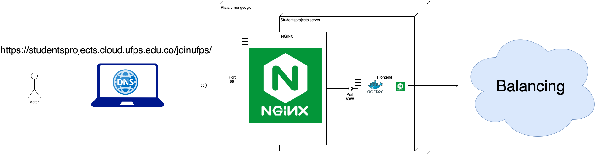
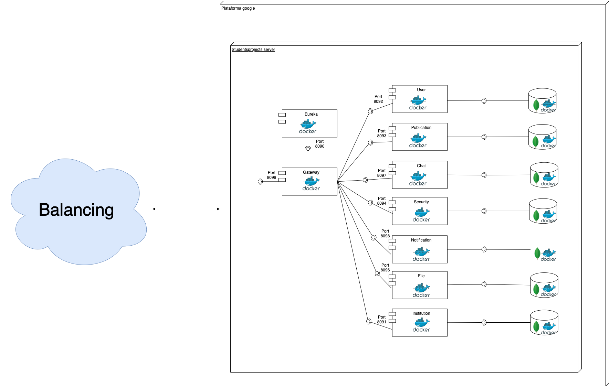
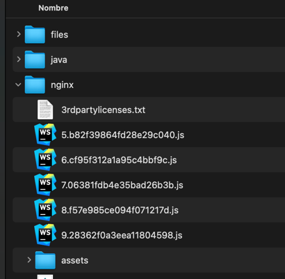
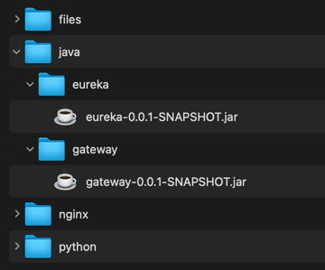
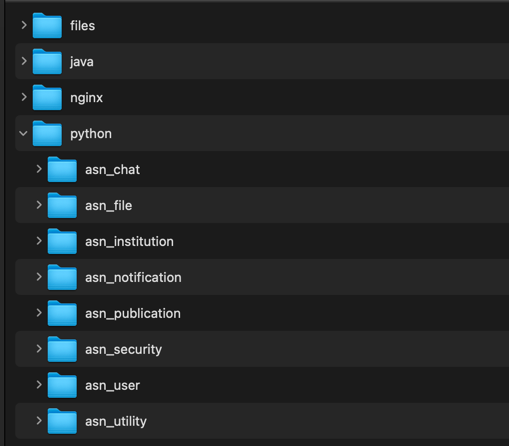
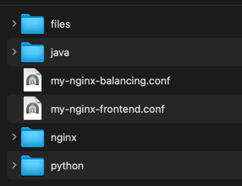
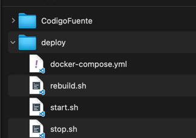

# Documentación acerca del despligue

Antes de seguir la guía, asegúrese de tener instalado docker y docker-compose: https://docs.docker.com/engine/install/ubuntu/.

Joinufps está conformada de un frontend realizado en Angular, y una serie de micro servicios construidos en Django.
En detalle encontramos los siguientes componentes y sus respectivos dockers:

##Componentes del frontend

##Componentes del backend

##Despliegue del proyecto

Todo los archivos necesarios para el despliegue del proyecto están organizados en dos directorios, uno para el código fuente
de cada proyecto y un segundo directorio donde se aloja los archivos necesarios para el despliegue. En el servidor de 
Ingeniería de Sistemas, donde se desplegó la aplicación se crearon estos dos directorios.

      código fuente: /var2/dockers-studentsprojects/joinus
      archivos de despligue: /var2/dockers-studentsprojects-deploy/joinus

Se sugiere conservar esta misma separación para despliegue local.

### Sobre el despliegue de la Base de datos (Mongo DB)

Para este caso la base de datos a subir será de MongoDB, ubicados en la carpeta de despliegue elegida, los pasos entonces son:

1. Descargar imagen de mongo con el siguiente comando:
   - docker pull mongo:latest
2. Crear configuración interna en docker con los siguientes comandos:
   - mkdir mongodb 
   - cd mongodb 
   - mkdir mongo-volume

Documentación de ejemplo para este tipo de despligue: https://diegoorozco.com/dockermongodb

Crear el container de base de datos, referenciando la nueva red creada

    docker container run -d --name mongo -p 27017:27017 --network tesis_asn_network mongo:latest

## Sobre despliegue del proyecto

El proyecto se despliega en dockers creados en el servidor de Ingeniería de Sistemas, para esto se usa la herramienta Docker Compose
la cual se trata de un archivo YAML que organiza los dockers que se ejecutaran asignando a cada uno de ellos un nombre; la imagen que usaran de DockerHub;
el directorio de trabajo “working_dir“ que será el inicial cuando ingresemos al docker; los volumenes para crear un espejo de los datos 
externos que se usaran dentro del docker; y por último, pero no menos importante se encuentra los puertos: que indican que puerto externo
(puerto físico) será su equivalente en el interior del docker (puerto virtual).

Así se define el docker de frontend:

      frontend:
       container_name: joinus_frontend
       image: nginx:1.17.1-alpine
       working_dir: /usr/local/app
       volumes:
         - type: bind
           source: /var2/dockers-studentsprojects/joinus/my-nginx-frontend.conf
           target: /etc/nginx/conf.d/default.conf
         - type: bind
           source: /var2/dockers-studentsprojects/joinus/nginx
           target: /usr/share/nginx/html
       ports:
         - 8088:80

Aquí podemos encontrar las características que se mencionaron anteriormente, se puede observar que la imagen base de este docker es `nginx` en su versión `1.17.1`,
la palabra clave `alpine` quiere decir que es una versión ligera. El puerto virtual por el cual se desplegara el frontend será el `80`, para acceder a este desde
el exterior se hace por el puerto físico `8080`. 

Los volumenes usan dos parámetros importantes: `source`, que indica el directorio físico que queremos reflejar en el interior del docker,
el cual será ubicado en la dirección de `target`.

Para el caso de los dockers que se basan en una imagen Java, se tiene el de eureka cómo ejemplo:

      eureka:
          container_name: joinus_eureka
          image: openjdk:12
          working_dir: /code
          ports:
            - 8090:8090
          volumes:
            - type: bind
              source: /var2/dockers-studentsprojects/joinus/java/eureka
              target: /code
          command: java -jar target/eureka-0.0.1-SNAPSHOT.jar

Es muy parecido al anterior solo con dos diferencias, la imagen es openjdk por estar basado en Java, también se observa
una línea command, esta ejecuta el comando especificado una vez el docker es creado, para este caso se ejecuta el jar de eureka
para ejecutar el servicio. Más adelante se muestran los pasos para generar este Jar en caso de no encontrarlo.

El caso de los dockers basados en python es algo similar:
   
      institution:
       container_name: joinus_institution
       image: python:3.8
       working_dir: /code
       ports:
         - 8091:8091
       volumes:
         - type: bind
           source: /var2/dockers-studentsprojects/joinus/python/institution
           target: /code
       command: bash -c "
         pip install -r requirements.txt &&
         python3 manage.py runserver 0.0.0.0:8091
         "

La imagen base es python:3.8 y se realizan dos comandos al iniciar el docker: el primero es para instalar las librerías 
en archivo de requerimientos `requeriments.txt`; y el segundo ejecuta la aplicación y la despliega en el puerto 8091.

      file:
       container_name: joinus_file
       image: python:3.8
       working_dir: /code
       ports:
         - 8096:8096
       volumes:
         - type: bind
           source: /var2/dockers-studentsprojects/joinus/python/file
           target: /code
         - type: bind
           source: /var2/dockers-studentsprojects/joinus/files
           target: /tesis-asn
       command: bash -c "
         pip install -r requirements.txt &&
         python3 manage.py runserver 0.0.0.0:8096
         "

El resto de dockers de python son similares, pero se resalta la definición del docker file debido a que hay algo a tener en cuenta en él.
Observe el segundo volumen, en el parámetro `source` se indica la ruta física donde se hara el respaldo de los archivos
que los usuarios suban a la plataforma, ya sea foto de perfil, o de una publicación, etc; y en el parámetro `target` se
indica la ruta virtual (dentro del docker).

## Ubicación del código fuente

Para desplegar los dockers en el servidor primero debemos guardar allí el código fuente, jars o archivos estáticos
de cada proyecto. En el servidor de Ingeniería de sistemas todo el código fuente quedo almacenado en la ruta: `/var2/dockers-studentsprojects/joinus/`,
allí se hizo una carpeta para cada lenguaje: java, python y también para el servidor web nginx que despliega el frontend, 
se recomienda tener los mismos directorios en su directorio de código fuente.

Las carpeta donde guarde el código fuente de cada lenguaje deberian tener la siguiente estructura:
   - java
   - files
   - nginx
   - python

En realidad puede nombrarla a su gusto, lo importante es que los tenga en cuenta en las rutas de los volumenes en docker-compose.yml.

   ###Docker frontend
   El docker `frontend` al estar construido sobre nginx no necesita de todo el código fuente para desplegarse, solo usa
   los archivos estáticos generados en el build del proyecto. Para generarlos puede hacer el siguiente comando en la raíz del proyecto frontend:

      ng build --prod

   Con este comando se generan los archivos estáticos en la carpeta `dist/tesis-asn`, todo esos archivos dentro de ella
   debe alojarlos en la carpeta donde esté guardando el código fuente del frontend, si sigue las indicaciones aquí debería
   ser en la carpeta `nginx`, para el despliegue de Joinufps se guardó en la carpeta `/var2/dockers-studentsprojects/joinus/nginx` 
   cómo lo puede confirmar en el segundo parámetro `source` del docker frontend.
   
   El parámetro `--prod` indica a la terminal que debera usar las urls del ambiente de producción, las cuales están guardadas
   en el archivo: `src/environments/environment.prod.ts` del proyecto del frontend.

   Siguiendo la estructura de directorios inicial (omitiendo algunos archivos en la imagen):

   

   ###Dockers eureka y gateway
   
   Para estos dos dockers que estan basados en Java es necesario obtener el Jar de cada uno el cual esta en la carpeta 
   target de cada uno de estos dos proyectos, si no los encuentra o desea actualizarlos puede hacerlo en la sección maven 
   con la opción `install`, así en la raíz del proyecto se creara la carpeta `target` y dentro de ella encontrara un
   archivo con extensión `.jar`, copie este archivo en la carpeta de su preferencia donde esté alojando todo el código fuente.

   Siguiendo la estructura de directorios inicial:
   

   ###Dockers en Python
   
   Para estos dockers el proceso es más largo pero no por complejidad, sino por cantidad, hay más proyectos de este lenguaje, ocho (8) en total. 
   El proceso es simple, en la carpeta que eligió para guardar el código python, clone o guarde el código fuente de cada proyecto y ya esta; si, asi de sencillo.
   
   Siguiendo la estructura de directorios inicial:
   
   
   ###Docker de files
   
   Para el docker de file aparte de clonar el código fuente de este proyecto cómo se explicó `Dockers en Python`, se debe crear
   un directorio para almacenar ahí los archivos que los usuarios suban en la aplicación. Se puede escoger cualquier directorio, 
   pero tenga presente que debe coincidir con la ruta del segundo parámetro source de los volumenes del docker `file`,
   que para el archivo `docker-compose.yml` es: `/var2/dockers-studentsprojects/joinus/files`.

   Si siguió los pasos anteriores la estructura de directorios debería verse así desde la capa más alta:
   
   

##Archivos conf de Nginx

Notará que en la raíz de este proyecto se encuentran tres (3) archivos con extensión `.conf`:
   1. my-nginx-init.conf
   2. my-nginx-frontend.conf
   3. my-nginx-balancing.conf

   ### Nginx iniciador
   
   El archivo `my-nginx-init.conf` es el archivo de configuración del nginx inicial, ya sea si lo observa en el servidor
   de Ingeniería de sistemas o en su servidor de aplicación local. Siempre hay un Nginx en su servidor
   o computador que inicia todo, allí debería guardar las `locations` que tiene este archivo. Entre ellas puede observar
   la location para el frontend `/joinufps`; para el balanceador de carga que simula un servidor remoto `/asn_balancing`; y la misma location
   pero para aceptar peticiones de websocket `/asn_balancing_socket` usada en el micro servicio de notification y chat. 
   Es de aclarar que el campo `proxy_pass` lo debe editar con la ip privada de su computadora o su servidor.

   ### Nginx del frontend
   
   El archivo `my-nginx-frontend.conf` es corto y sirve para que al acceder a la location `/joinufps` del archivo `my-nginx-init.conf`
   este se ubique en la carpeta donde esta almacena el código estatico del frontend, el cual esta en `/usr/share/nginx/html` dentro del docker
   del frontend. El contenido del archivo `my-nginx-frontend.conf` debe ir en el archivo .conf del nginx de su docker `frontend`.

   ### Nginx del balanceador de carga (Balancing)
   
   El archivo `my-nginx-balancing.conf` es muy importante pues aquí se da acceso a los microservicios de eureka y apigateway, 
   necesarios para permitir el consumo de todos los servicios de Python. También permite la comunicación con los websockets
   expuestos por los micro servicios Notification y Chat. Estas locations deben ir en la configuración del Nginx en el 
   docker `balancing`, con la dirección ip privada de su servidor o computador.

   Estos dos últimos archivos `my-nginx-frontend.conf` y `my-nginx-balancing.conf` deben ir en la raíz del directorio donde alojó
   el código fuente.

   Siguiendo la estructura de directorios inicial:
   

## Creación y administración de dockers.
   
   Una vez realizadas las anteriores configuraciones, es decir preparado el directorio que contiene todo el código fuente
   y configurados el Ngnix local o Nginx inicial, cómo desee llamarlo, entonces se puede iniciar con la creación de los dockers. 

   Hay tres archivos en la raíz de este proyecto que serán usados para este fin.    

   El archivo `rebuild.sh` nos ayuda a construir los dockers que esten definidos en el archivo docker-compose.yml,
   para este caso esté último archivo debe estar al mismo nivel de carpetas que el archivo .sh.

   Los archivos `start.sh` y `stop.sh` sirven para iniciar y detener los dockers respectivamente.

   Estos tres archivos deben ir en un directorio definido para contener archivos de despliegue, para este proyecto se 
   nombró `deploy` y dentro del servidor de Ingeniería de sistemas se encuentra en la siguiente ruta:
   
      /var2/dockers-studentsprojects-deploy/joinus

   Siguiendo el despliegue local el directorio se encuentra aquí:

   

   El archivo ``docker-compose.yml`` también debe ir en este directorio.

   Ejecute el archivo `rebuild.sh` los dockers iniciaran a crearse, y dentro de unos minutos Joinufps
   se mostrara en la location que usted le haya colocado en el Nginx inicial.

   
   

   
    
   