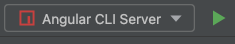

## Documentación acerca de la Interfaz Grafica de Joinus (Frontend)

El frontend de Joinus fue construido sobre el framework de aplicaciones web Angular. Angular ofrece una arquitectura
limpia (Clean Architecture) para llevar a cabo la estructura que se tenia en mente para el proyecto, separando cada
responsabilidad en su respectivo modulo y permitiendo que el código se pueda escalar.

## Tabla de contenidos:
___

- [Tecnologías](#tecnologías)
- [Arquitectura](#arquitectura)
  - [Servicios e inyección de dependencias](#servicios)
  - [Modelos](#modelos)
  - [Servicios](#servicios)
  - [Adaptadores](#adaptadores)
  - [Interceptor](#interceptor)
  - [Rutas](#rutas)
  - [Módulos](#módulos)
  - [Componentes](#componentes)
- [Ejecución](#ejecución)
- [Pruebas](#pruebas)

## Tecnologías

___
Las tecnologías y lenguajes usados para el frontend son:

- Angular CLI 
- Node 
- Typescript 
- Bootstrap 
- Primeng 

## Arquitectura

___
El desarrollo del Frontend en Angular fue diseñado según la arquitectura recomendada por ellos, y esta hace una
separación entre:

- Modulos
- Componentes
  - Templetes
  - Directivas
  - DataBinding
- Servicios e inyección de dependencias
  - Servicios
  - Rutas

El proyecto crea paquetes para encapsular aquellas clases que se relacionan entre sí, cada uno de ellos almacenan las
clases necesarias para la comunicación y el procesamiento de las acciones del usuario en la red. A continuación, se
profundizará en aquellas clases más importantes en el código.

### Servicios e inyección de dependencias

En esta capa se distribuyen las clases que procesan la lógica del dominio y también los modelos que representan las
entidades del mundo real. Los servicios realizan el consumo de los endpoints ofrecidos por el Backend, y su respuesta es
enviada a los adaptadores para transformar de lenguaje Json a Objetos y crear así los modelos, mientras que los
interceptores capturan cualquier excepción o mensaje erróneo que respondan los servicios.

### Modelos

Iniciando por el paquete de más bajo nivel y que representan las entidades de negocio, se encuentran los models o
modelos agrupados por la similitud de las funcionalidades en donde son usados, un ejemplo de esto sería la figura a
continuación, aquí se reciben sus atributos por inyección de dependencia a través del constructor y para ser fiel a las
características de modelos no contienen ninguna lógica.

### Servicios

Los services o servicios son aquellas clases que agrupadas por similitud ayudan a acceder a los endpoints ofrecidos por
Backend, en cada una de ellas se implementó las peticiones según sea el método REST que se quería realizar y retornar el
resultado de la consulta. Adicional todos los datos o lógica que no está asociada directamente a una vista y que quieres
utilizar en diferentes partes de la aplicación y entre diferentes componentes, puede ser escrita en un servicio. Tal
como un componente, los servicios son exportados como clases.

Como se puede observar en la figura anterior los servicios reciben por inyección de dependencias a través de su
constructor una instancia de la clase HttpClient, el cual es el que realiza la petición REST dentro de los métodos de la
clase, finalmente cada uno de ellos retorna una promise. Los servicios obtienen la URL base desde el archivo
environment, el cual se puede encontrar para ambiente de desarrollo y de producción.

### Adaptadores

Los adapters o adaptadores son aquellas clases que traducen la respuesta recibida del servicio que para este caso es en
formato Json a un objeto models, es decir transforman la respuesta de Json a Objeto, y de manera inversa traducen de
Modelo a Json para guardar o actualizar los datos.

Como se refleja en la figura anterior las clases adaptadoras implementan la interfaz Adapter, la cual sirve de contrato
para que las clases específicas implementen sus métodos, retornando un objeto T el cual es el tipo de Objeto que
retornan, para el caso de RoleAdapter seria RoleModel, y para ModuleAdapter es ModuleModel.

### Interceptor

En este se encuentra la clase HttpErrorInterceptor la cual implementa de HttpInterceptor que ofrece su método
interceptor y como su nombre lo dice, lo que hace es interceptar todas las respuestas que lleguen ya sean erróneas o no,
y realiza las acciones correspondientes dependiendo del caso.

Esta clase captura los errores antes de llegar al método que hizo la petición originalmente a través de su método
implementado intercept y que por medio de validateError determina como procesar la excepción, por ejemplo, una solución
sería mostrar un mensaje de error por medio del objeto messageService o tal vez redirigir a la tan conocida página 404
con el objeto router.

### Rutas

En este apartado se definen las rutas de navegación o routing de cada página de la red, estas rutas están conformadas
por un path y un component, definiendo la ruta de navegación y el componente que debe mostrarse según esa ruta. Las
rutas se pueden encontrar en los archivos "routing".

### Módulos

Los Módulos o técnicamente llamados NgModules sirven para registrar los componentes que se usarán en la aplicación, cada
componente que se crea deberá declararse dentro de un Module. Existe también un NgModule principal “AppModule” que es el
encargado de establecer el mecanismo de ejecución que inicia la aplicación.

Existen componentes que se usan en más de un flujo, por tanto, estos no pueden estar acoplados a un solo Módulo. Se crea
un módulo compartido “SharedModule” para importar desde allí esos componentes y además los widgets de PrimeNG que
también se usan en funcionalidades distintas.

### Componentes

En los componentes se encuentran los datos que se mostrarán en los Templates, y los cuales están formados de un archivo
.ts y un .html, juntos gracias al Databinding pueden trabajar en conjunto para mostrar vistas reactivas y actualizadas
al usuario.

El componente base es nombrado como ‘container’ y este en su template permite mantener siempre el navbar visible en
cualquier página web en la que se encuentre el usuario, a su vez agrega a <router-outlet> el cual permite que haya el
cambio visual de una página a otra mediante el cambio de la ruta en el navegador.

La mayoría de componentes implementan de OnInit para sobrescribir el método ngOnInit del ciclo de vida de estos, de esta
forma podemos inicializar los datos y/o recibirlos por un @Input antes de mostrarlos en el template, evitando hacer
llamadas remotas o construir objetos pesados en el constructor.

Algunos componentes tardan en obtener la información para mostrarla, por tanto, se creó un componente nombrado Skeleton
para que haga de efecto cargando mientras se procesa la información.

A lo largo del código fuente se encuentran diferentes componentes con sus respectivos Templates, el proyecto Frontend
está organizado de tal forma que cada componente y subcomponente se manejan como algo aislado, por ejemplo en el caso de
las publicaciones un componente ListPublications se encarga de obtenerlas y él delega a CardPublication la
responsabilidad de mostrar la información de una publicación individual, aquí se implementa el patrón de diseño
Contenedor-Presentador, donde los componentes principales hacen de contenedor y los subcomponentes como las cards que
solo presentan información serán los presentadores; de esta forma se mantiene coherencia en cada uno de ellos y lo que
es igual de importante el principio de responsabilidad única.

## Guía de configuración

___

A continuación se explicaran los pasos a seguir para desplegar el frontend de manera local y así estar listos para
agregar más características o corregir fallos. Para esto se recomienda usar el IDE WebStorm de Jetbrains.

### node_modules

Una vez clonado el proyecto lo primero que solicitara el IDE es ejecutar el comando `npm install`, este sencillo comando
creara una carpeta llamada node_modules, la cual tendra las dependencias que necesita el proyecto frontend.

### Ejecutar proyecto

Para ejecutar el proyecto de manera local simplemente ejecute el comando `ng serve`. El IDE ofrece una manera más
grafica de hacerlo y es dado click al botón ejecutar que aparece en la parte superior de color verde, cómo se ve en la
siguiente imagen:

De cualquier de la dos formas que realice, el proyecto se ejecutara en `http://localhost:4200/`, la aplicación se
recargara automaticamente a medida que usted inserte o modifique archivos.

### Despliegue

Una vez se desea lanzar los cambios a producción, basta con realizar el comando `ng build --prod`. Los artefactos
construidos se almacenan en la carpeta `dist/`, estos cambios son los que debe llevar al servidor.

## Pruebas unitarias

___
Con el comando `ng test` se ejecutan las pruebas unitarias usando
karma . Las pruebas quedan en la carpeta `coverage/`.
